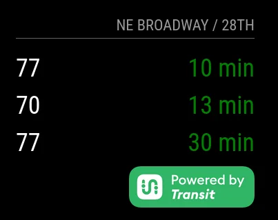

# MMM-TransitApp

This [MagicMirror](https://magicmirror.builders/) module displays upcoming bus or train times from any transit stop across [150+ transit agencies in 25 countries](https://transitapp.com/en/region).  See if your stop is served by [Transit](https://transitapp.com/) using their app before investing time in this module!



## Pre-requisites

Before you begin, ensure you have:

1.  A working [MagicMirror²](https://magicmirror.builders/) installation.
2.  [Request an API key](https://transitapp.com/apis) from Transit App.  See the Transit App documentation for details.
3.  Get the bus/train station code using the `/public/nearby_stops` endpoint through a bash terminal.

```bash
sudo apt update
sudo apt install curl jq

API_KEY=(Your Transit App API key)
STATION_LATITUDE=(Latitude of your bus/train stop)
STATION_LONGITUDE=(Longitude of your bus/train stop)

curl  -H "Accept-Language:en" -H "apiKey:$API_KEY" "https://external.transitapp.com/v3/public/nearby_stops?lat=$STATION_LATITUDE&lon=$STATION_LONGITUDE" | jq
```
From the JSON response, make a note of the `"global_stop_id"` of your stop. It will be formatted as `"ABC:12345"`. If you would like to monitor multiple stops, please use multiple instances of this module.

The free tier is limited to 1500 calls per month, or about one every 30 minutes. The display will update every 30 seconds, but the API calls are cached. To do more frequent API calls during your commute hours for better real-time info, consider setting the `activeHours` configuration value to disable refreshing when you do not need real-time transit times.

## Configuration Options

| Option             | Description                                                                 | Default     |
| ------------------ | --------------------------------------------------------------------------- | ----------- |
| `global_stop_id` (required)  | The global stop ID from the Transit App API.                               | `""`        |
| `apiKey` (required)           | Your Transit App API key.                                                   | `""`        |
| `logosize`         | Size of the transit logo.                                                   | `"40px"`    |
| `displayed_entries`| Number of bus times to display.                                             | `3`         |
| `fontsize`         | Font size for bus times.                                                    | `"24px"`    |
| `logoLocation`     | Logo alignment (`flex-start`, `flex-end`).                                  | `"flex-end"`|
| `activeHoursStart` | Active hours for the module (24-hour format).                               | `6`         |
| `activeHoursEnd`   | Active hours end for the module (24-hour format).                           | `22`        |
| `activeDays`       | Active days of the week (0 = Sunday, 6 = Saturday).                         | `[0, 1, 2, 3, 4, 5, 6]`|
| `updateFrequency`  | Update frequency in minutes.                                                | `30`        |


### Install

In your terminal, go to your MagicMirror² Module folder and clone MMM-Template:

```bash
cd ~/MagicMirror/modules
git clone https://github.com/thariq-shanavas/MMM-TransitApp
```

### Update

```bash
cd ~/MagicMirror/modules/MMM-TransitApp
git pull
```

## Using the module

To use this module, add it to the modules array in the `config/config.js` file:

```js
    {
        module: 'MMM-TransitApp',
        position: 'lower_third',
        header: 'Your Stop Name',
        config: {
            global_stop_id: 'abc:1234'
            apiKey: ''
        }
    },
```

## Known Issues

The Transit API has a limitation where it only returns a maximum of 3 future departures for any given route. For example, if the actual departures are:

1.  9:30 AM - Bus A
2.  9:35 AM - Bus A
3.  9:40 AM - Bus A
4.  9:45 AM - Bus A
5.  9:50 AM - Bus B

The API will return:

1.  9:30 AM - Bus A
2.  9:35 AM - Bus A
3.  9:40 AM - Bus A
4.  9:50 AM - Bus B

This behavior is a limitation of the Transit API and is unlikely to be fixed. The issue is partially mitigated by more frequent API calls.